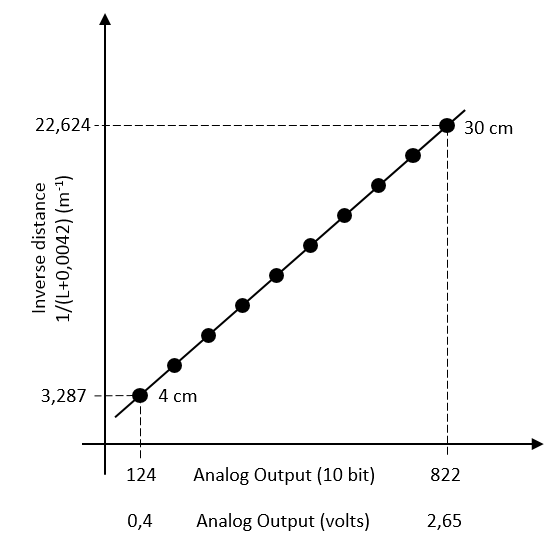
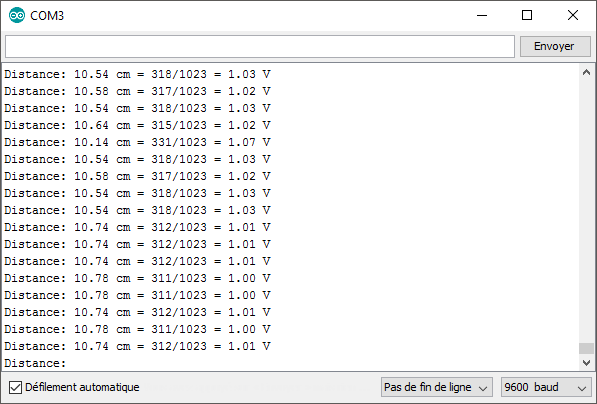

# ESP-8266 Object Detection Using GP2Y0A41SK0F Optical Distance Sensor

The GP2Y0A41SK0F is an analog output type distance measuring sensor. The sensor operating voltage Vcc is between 4,5 and 5,5 volts. The measuring distance range is between 4 and 30 cm. The analog output voltage Vo varies as a function of the inverse of the distance; the output voltage raises as the object is approaching. Typically, the output voltage is 0,40 ± 0,15 volts at far distance (30 cm) and 2,65 ± 0,45 volts at close distance (4 cm). The technical datasheet contains a lot of information and a graphic of the output voltage in relation of the actual distance to the object.



The ESP-8266 has a single analog to digital converter (ADC). To read external voltage applied to pin A0, use the function analogRead(A0). The input voltage range is 0,0 to 3,3 volts and the digital value returned by analogRead(A0) is between 0 and 1023 (10-bit resolution). 

⚠ **Warning! Earlier versions of the ESP-8266 had a maximum operating voltage of 1,0 volt on pin A0, so please check your board before testing your circuit.**

The following circuit diagram explains how connect the distance sensor to your ESP-8266.


```
/*
 * Copyright 2017 Richard Ng-Jobidon
 *
 * Licensed under the Apache License, Version 2.0 (the "License");
 * you may not use this file except in compliance with the License.
 * You may obtain a copy of the License at
 *
 *     http://www.apache.org/licenses/LICENSE-2.0
 *
 * Unless required by applicable law or agreed to in writing, software
 * distributed under the License is distributed on an "AS IS" BASIS,
 * WITHOUT WARRANTIES OR CONDITIONS OF ANY KIND, either express or implied.
 * See the License for the specific language governing permissions and
 * limitations under the License.
 */
 
// This program allows the ESP-8266 to read data from GP2Y0A41SK0F distance measuring sensor

// Sensor calibration - You can change these values
const int minimum_position_analog = 818;  // Your sensor analog reading at 4 cm (typical value is 822)
const int maximum_position_analog = 102;  // Your sensor analog reading at 30 cm (typical value is 124)

// Sensor constants
const float minimum_position_meter = 0.04;  // Sensor minimum position (fixed at 4 cm)
const float maximum_position_meter = 0.30;  // Sensor maximum position (fixed at 30 cm)
const float sensor_offset = 0.0042;         // Sensor offset position (fixed at 0.42 cm)
const float sensor_slope = ((1.0/(minimum_position_meter + sensor_offset)) - (1.0/(maximum_position_meter + sensor_offset))) / (minimum_position_analog - maximum_position_analog);
const float sensor_yintercept = (1.0/(minimum_position_meter + sensor_offset)) - (sensor_slope * minimum_position_analog);

// Global variables
int current_position_analog = 0;
float current_position_meter = 0;
float current_position_volt = 0;

// Setup code to run once
void setup() {
  Serial.begin(9600);
  pinMode(A0, INPUT);
}

// Convert analog reading (0..1023) to position in meter
float convertPosition(int analogPosition) {
  // Local variables
  float realPosition = 0;

  // Too far
  if (analogPosition < maximum_position_analog) {
    realPosition = maximum_position_meter;
  }

  // Too close
  else if (analogPosition > minimum_position_analog) {
    realPosition = minimum_position_meter;
  }

  // Within sensor range
  else {
    realPosition = (1.0 / ((sensor_slope * analogPosition) + sensor_yintercept)) - sensor_offset;
  }

  // Return value
  return realPosition;
}

// Read sensor output analog voltage 
void readSensorData() {
  current_position_analog = (int)analogRead(A0);
  current_position_volt = 3.3 * current_position_analog / 1023;
  current_position_meter = convertPosition(current_position_analog);
}

// Print sensor readings to serial monitor
void printSensorData() {
  Serial.print("Distance: ");
  Serial.print(100.0 * current_position_meter);
  Serial.print(" cm = ");
  Serial.print(current_position_analog);
  Serial.print("/1023 = ");
  Serial.print(current_position_volt);
  Serial.println(" V");
}

// Main code to run repeatedly
void loop() {
  readSensorData();
  printSensorData();
}
```

