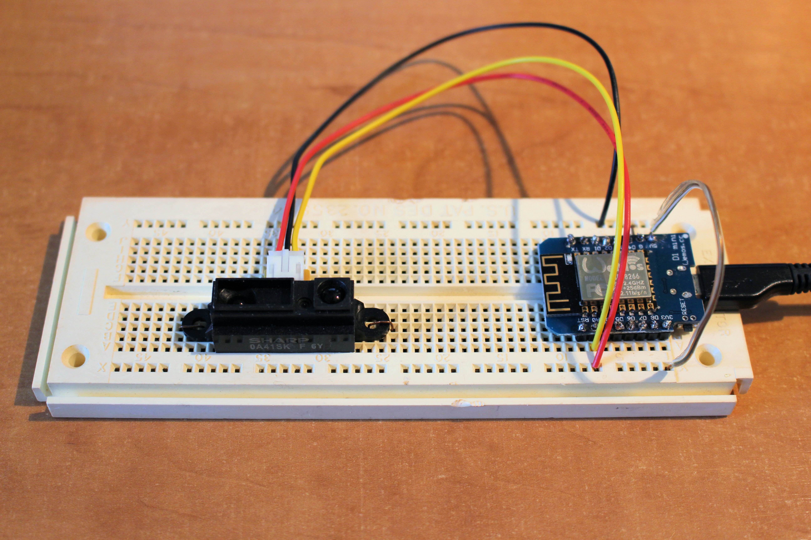
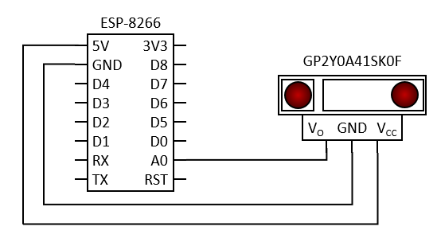

# ESP-8266 Object Detection Using GP2Y0A41SK0F Optical Distance Sensor

The GP2Y0A41SK0F is an analog output type distance measuring sensor made by Sharp. The sensor operating voltage Vcc is between 4,5 and 5,5 volts. The measuring distance range is between 4 and 30 cm. The analog output voltage Vo varies as a function of the inverse of the distance; the output voltage raises as the object is approaching. Typically, the output voltage is 0,40 ± 0,15 volts at far distance (30 cm) and 2,65 ± 0,45 volts at close distance (4 cm). The technical datasheet contains a lot of information and a graphic of the output voltage in relation of the actual distance to the object.

The ESP-8266 has a single analog to digital converter (ADC). To read external voltage applied to pin A0, use the function analogRead(A0). The input voltage range is 0,0 to 3.3 volts and the digital value returned by analogRead(A0) is between 0 and 1023 (10-bit resolution). 

⚠ **Warning! Earlier versions of the ESP-8266 had a maximum operating voltage of 1,0 volt on pin A0, so please check your board before testing your circuit.**

The following circuit diagram explains how easy you can integrate the distance sensor to your project.

